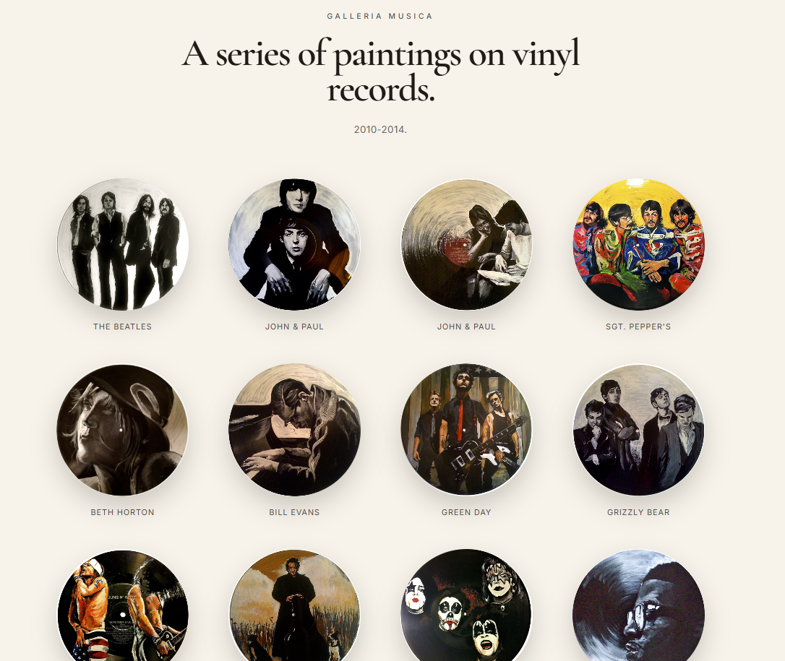

# Galleria Musica

A minimal Jekyll gallery for presenting a body of visual work.

This repository contains a clean, responsive gallery designed for artists, illustrators, photographers, and anyone who wants to showcase a body of work with minimal distraction.

The example collection featured here is **Galleria Musica**, a series of acrylic paintings on vinyl records created between **2010–2014**.

---



---

## Live Demo

View the live site here:

**https://kevinkell-y.github.io/visual-archive/**

---

## Features

- Minimal museum-inspired design
- Responsive CSS Grid layout
- Circular artwork presentation
- Beautiful typography using Google Fonts
- Click-to-enlarge lightbox
- Data-driven gallery using YAML
- GitHub Pages compatible
- No JavaScript framework required

---

## Built With

- Jekyll
- GitHub Pages
- HTML5
- CSS3
- YAML

---

## Project Structure

```text
visual-archive/
│
├── _config.yml
├── index.html
├── README.md
├── Gemfile
│
├── _data/
│   └── artworks.yml
│
├── assets/
│   ├── css/
│   │   └── style.css
│   │
│   ├── img/
│   │   ├── music-art-*.jpg
│   │   └── readme/
│   │       └── galleria-musica-preview.png
│   │
│   └── js/
│
└── _site/
```

---

## Running Locally

Install the project dependencies:

```bash
bundle install
```

Start the Jekyll server:

```bash
bundle exec jekyll serve
```

Then visit:

```
http://127.0.0.1:4000/
```

---

## Adding Artwork

Place your artwork images inside

```
assets/img/
```

Then add an entry to

```
_data/artworks.yml
```

Example:

```yaml
- title: "The Starry Night"
  image: "/assets/img/starry-night.jpg"
  medium: "Oil on canvas"
```

The gallery updates automatically.

---

## Changing the Gallery Header

Edit the hero section in

```
index.html
```

Example:

```html
<p class="eyebrow">GALLERIA MUSICA</p>

<h1>
A series of paintings on vinyl records.
</h1>

<p class="intro">
2010–2014
</p>
```

---

## Customizing the Design

Almost every visual aspect of the gallery lives in

```
assets/css/style.css
```

including

- typography
- spacing
- image size
- hover animations
- colors
- responsive layout
- lightbox styling

---

## Deploying to GitHub Pages

Push the repository to GitHub.

Then open

```
Settings
    ↓
Pages
```

Select

```
Source:
Deploy from a branch

Branch:
main

Folder:
/ (root)
```

GitHub will automatically build and publish the site.

---

## Why This Exists

Most portfolio websites are overloaded with navigation, animations, and visual clutter.

The goal of this project is different.

The artwork should be the first thing people notice.

Everything else should quietly support it.

Inspired by museum exhibition catalogs, gallery walls, and minimalist editorial design, this template aims to present artwork with elegance while remaining easy to customize and completely free to host.

---

## License

MIT License

Feel free to fork, modify, and build upon this project for your own portfolio or gallery.